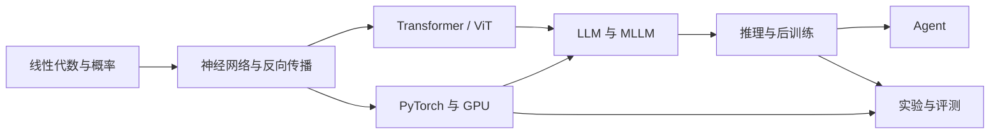

## 这套路线解决什么问题

初学 AI 最常见的困境不是资料少，而是资料之间没有依赖关系：会调用模型却解释不了注意力；会跑训练却不知道损失为何下降；读了论文，却无法判断实验是否可信。

这套路线的终点是四种可验证能力：

1. 能用自己的话和公式解释模型，而非背名词；
2. 能从零写出数据、模型、训练、评测闭环；
3. 能检索论文、复现代码、设计对照实验；
4. 能搭建一个会规划、用工具、有记忆且可测试的 Agent。

## 8 周节奏

| 周次 | 主线 | 必须产出 |
|---|---|---|
| 0 | 检索与科研方法 | 一张领域论文地图 |
| 1 | 神经网络、梯度、反向传播 | 手写两层 MLP 与梯度检查 |
| 2 | CNN / ResNet / RNN / GNN；PyTorch | 一个规范训练工程 |
| 3 | Transformer 与模型家族 | 手写 Self-Attention |
| 4 | ViT、LLaVA、Qwen-VL | 一份多模态架构对比表 |
| 5 | Prompt、CoT、SFT、DPO | 一个可重复的推理评测脚本 |
| 6 | PPO、GRPO、OPD、R1-like 训练 | 后训练算法选择报告 |
| 7 | Agent、Skill、MCP、测试 | 有 3 个工具的 Agent |
| 8 | 结课实验 | 仓库、实验日志、报告 |

每天建议采用 `40% 原理 + 40% 代码 + 20% 复盘`。只看教程不运行代码不算完成；只把代码跑通却解释不出张量形状，也不算完成。

这不是要求每天平均推进。建议每周安排 12–18 小时：前两天补概念，中间三天写代码和做实验，最后一天复盘并补文档。如果课程、考试或算力使进度落后，优先保留“基础概念 → 最小基线 → 评测 → 错误分析”，删减模型规模，不要删掉验证环节。

## 专题文章索引

这篇文章只负责导航，不代替各专题正文。推荐按以下顺序阅读：

1. [论文检索、阅读与复现](/research-literacy/)；
2. [神经网络、反向传播与优化](/neural-network-backprop/)；
3. [CNN、ResNet、RNN 与 GNN](/deep-learning-architectures/)；
4. [PyTorch、GPU 与 Hugging Face](/pytorch-huggingface-gpu/)；
5. [Transformer 核心机制](/transformer-core/)；
6. [BERT、GPT、LLaMA 与 Qwen](/llm-families/)；
7. [ViT、LLaVA 与 Qwen-VL](/vision-multimodal-models/)；
8. [Prompt、CoT 与 API](/prompt-cot-api/)；
9. [SFT、DPO、PPO、GRPO 与 OPD](/llm-post-training/)；
10. [推理基准与可信评测](/reasoning-benchmarks/)；
11. [Rationale Learning](/rationale-learning/)；
12. [Agent 架构与 Harness](/agent-architecture-harness/)；
13. [Skill、MCP 与软件测试](/agent-skills-mcp-testing/)；
14. [推理模型微调实战](/reasoning-finetune-lab/)；
15. [Agent 系统实战](/agent-systems-lab/)。

## 最小知识依赖

需要会 Python 基础、线性代数中的矩阵乘法与导数、概率中的期望与条件概率。微积分薄弱时，先掌握链式法则、偏导、梯度；线性代数薄弱时，先掌握向量、矩阵、转置、内积和范数。不必等数学“全部学完”才开始，遇到公式再定向补齐。



## 学习闭环

每个主题都按同一循环推进：

- **定义问题**：模型要优化什么？输入、输出、约束是什么？
- **建立基线**：先得到一个简单、稳定、可复现的结果。
- **阅读证据**：从综述找关键词，再读原论文和官方实现。
- **最小复现**：先用小模型、小数据、少步数验证流程。
- **消融与分析**：一次只改一个变量，记录均值、方差和失败样例。
- **形成结论**：区分“观察到”“推测”和“已经证明”。

## 环境建议

优先使用 Linux/WSL2、Git、Python 虚拟环境和 NVIDIA GPU。GPU 不足时，选择 Qwen 1.5B/3B 量级、LoRA/QLoRA、小数据子集和短上下文。算力限制会改变实验规模，但不应省略基线、固定随机种子、保存配置和错误分析。

建议仓库结构：

```text
project/
├─ configs/       # 所有可复现实验配置
├─ data/          # 原始数据只读，处理结果分开
├─ src/           # 模型、训练、评测
├─ scripts/       # 一条命令可运行的入口
├─ outputs/       # checkpoint、指标、日志
├─ tests/         # 数据与工具测试
└─ README.md      # 环境、命令、结果、限制
```

## 完成标准

最终提交不能只有 checkpoint。至少包含：问题定义、相关工作、数据说明、基线、训练配置、硬件与耗时、主要结果、消融、失败样例、局限和复现命令。能让另一位同学在不同机器上得到方向一致的结果，才算真正完成。

## 每周自检

每周用四个问题检查自己，而不是用“看了多少页”衡量进度：

- 我能否不看资料解释本周最重要的三个概念？
- 我能否写出输入、输出和关键张量的形状？
- 我是否保存了可重复运行的命令、配置和原始输出？
- 如果结果不对，我能否给出证据支持的排查顺序？

前三周更看重基础正确性，后五周逐渐增加论文证据、对照实验和失败分析。没有通过检查点时先补缺口，不要用继续堆新名词掩盖问题。

:::tip[从这里继续]
先读《论文检索、阅读与复现方法》，再进入《神经网络、反向传播与优化》。学习地图页可以随时回到全局视角。
:::
