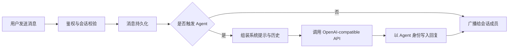

把大模型接进聊天应用，最简单的做法是在页面上放一个「AI 对话」入口；更有价值的做法，是让 Agent 真正进入消息系统：拥有身份、参与会话、遵守权限，并与普通消息共享持久化和实时分发链路。

Lchat 采用了后一种思路。Agent 是一个独立聊天用户，可以被私聊，也可以在公共频道或群组中通过 `@Agent名称` 唤醒。这个选择看似只是产品形态不同，背后却会影响数据模型、上下文构造、并发控制与安全边界。

## 一条消息如何变成一次模型调用

核心链路可以压缩为六步：



这里最关键的顺序是「先持久化用户消息，再异步触发 Agent」。消息系统是真相来源，模型调用只是一个可能失败的下游任务。即使上游模型超时，原消息也不应丢失；客户端重连后仍能通过历史接口恢复会话。

触发条件则取决于会话类型：

| 场景 | 触发方式 | 需要额外校验的边界 |
| --- | --- | --- |
| 私聊 | 收件人就是 Agent | 当前用户是否能访问该 Agent |
| 公共频道 | 消息包含 `@Agent名称` | 名称解析、重复提及与限流 |
| 群聊 | 在目标群中 `@Agent名称` | 用户与 Agent 是否都属于该群 |
| 内置命令 | `/help`、`/weather` 等 | 命令参数和工具权限 |

## 为什么要把 Agent 设计成「用户」

如果 AI 回复只是前端临时生成的文本，它不会自然地拥有消息 ID、时间戳、已读状态和历史记录。把 Agent 建模为用户后，现有 IM 能力可以直接复用：

- 回复仍是一条标准消息，可以持久化、检索和跨端同步；
- 私聊、公共频道和群组共用同一条消息路由；
- Agent 头像、名称和所有者可以进入现有资料系统；
- 权限校验发生在服务端，而不是依赖前端隐藏按钮；
- 未来接入多个 Agent 时，不需要为每个模型另造一套会话协议。

代价也很明确：Agent 身份必须有唯一性约束，其所有者与普通参与者的权限必须分开，删除配置时还要决定是否保留历史消息。好的抽象不是没有成本，而是让成本落在已有系统能够理解的位置。

## 上下文不是「把历史全部塞进去」

模型请求至少包含三层内容：

1. **系统层**：Agent 的角色、语气、能力边界和安全约束；
2. **会话层**：最近若干轮与当前会话相关的消息；
3. **本轮输入**：去掉无意义提及后的用户问题。

一个实用的预算方式是先为输出预留空间，再反向填充历史：

```text
可用历史预算 = 模型上下文上限 - 系统提示 - 当前问题 - 预留输出 - 安全余量
```

历史应从新到旧选择完整对话轮次，最后再恢复时间顺序。不要从一条长消息的中间硬截断，也不要把其他私聊或群组的内容混入当前上下文。多用户系统里，「上下文隔离」和数据库查询权限其实是同一个安全问题。

当对话变长时，可以逐步加入摘要与检索，但不要一开始就堆复杂的记忆系统。先记录三项指标：上下文 token 数、模型首字延迟、回答中引用历史的准确率。只有窗口裁剪确实破坏体验时，摘要或 RAG 才有明确收益。

## 幂等与并发：最容易被忽略的工程问题

聊天客户端在弱网下会重试发送。如果相同消息被服务端处理两次，普通聊天可能只是出现两个气泡，Agent 场景却会额外产生两次付费模型调用和两条不同回复。

Lchat 的消息接口支持客户端提供 `client_id`。同一用户用相同 ID 原样重试时，服务端返回原消息，不重复落库、广播或触发 Agent；若相同 ID 携带不同内容，则返回冲突。于是幂等边界可以表达为：

```text
幂等键 = sender_id + client_id
副作用 = 保存消息 + 广播消息 + 触发 Agent
```

Agent Manager 还需要全局并发上限。它不只保护模型供应商的速率限制，也保护自己的连接池、内存和响应队列。更稳健的做法是「有界队列 + 超时 + 可观察的失败」，而不是无限创建 goroutine。超时后应写入明确的失败状态或系统提示，不能让用户面对永久的“正在输入”。

## OpenAI-compatible 不等于可以信任任意地址

允许用户填写 `base_url` 很方便：云端 API、本机推理服务和不同兼容供应商都能接入。但在服务端发起请求时，它也会形成 SSRF 风险。攻击者可能让服务器访问回环地址、云元数据地址或内网管理接口。

因此 Lchat 默认拒绝回环、私网、链路本地和组播地址，并在真正连接前复查 DNS 解析结果；环境代理同样默认关闭。只有部署者明确设置开关时，才允许访问本机 Ollama 一类可信服务。这条边界应和密钥管理一起考虑：

:::warning[生产环境检查]

- API Key 只从环境变量或登录用户的受保护配置注入，不写入仓库；
- 日志不记录 Authorization 头、完整请求体和模型密钥；
- 上游 URL 同时检查协议、主机、DNS 结果和重定向目标；
- 对每个用户、Agent 与全局调用分别限流；
- 模型输出仍按不可信内容处理，不能直接拼接为 HTML 或系统命令。

:::

## 最小可用到可维护的演进路线

一个合理的开发顺序是：

1. 私聊单 Agent，完成身份、消息落库和基本调用；
2. 加入群聊提及与严格的会话成员校验；
3. 增加 token 预算、超时、幂等和并发限制；
4. 补齐调用耗时、失败类型、token 消耗等指标；
5. 最后再加入工具调用、摘要记忆或知识库检索。

LLM 应用真正难的部分通常不是完成一次 HTTP 请求，而是让非确定性的模型稳定地进入一个确定性的业务系统。身份、权限、持久化、幂等和可观测性，才是 Agent 从 Demo 走向产品的分界线。

## 延伸阅读

- [Lchat / IM-system 源码](https://github.com/Sakura1314lyc/IM-system)
- [Retrieval-Augmented Generation 原始论文](https://arxiv.org/abs/2005.11401)
- [Lost in the Middle：长上下文中的信息位置问题](https://arxiv.org/abs/2307.03172)
