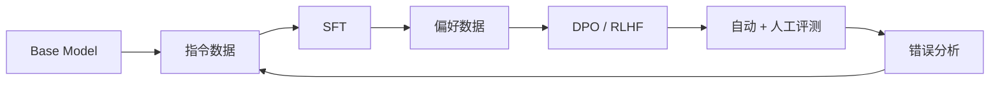

预训练让模型学会「语言与世界是什么样」，后训练则让模型学会「面对用户时应该怎样回答」。它不是一种单独算法，而是一条由数据、监督微调、偏好对齐、评测和安全策略组成的流水线。

这篇文章整理一条适合个人研究的学习路线。目标不是堆满术语，而是建立一个可以实际运行、比较和复现的最小闭环。

## 先画出全局地图



不同阶段解决的问题并不相同：

| 阶段 | 主要目标 | 典型数据 | 常见失败 |
| --- | --- | --- | --- |
| SFT | 学会指令格式和目标任务 | `prompt → response` | 模仿噪声、遗忘基础能力 |
| 奖励建模 | 近似人类偏好 | `chosen / rejected` | 学到长度、语气等伪特征 |
| DPO | 直接提高偏好答案概率 | 偏好对 | 对超参数和数据差异敏感 |
| RLHF | 在奖励信号下优化策略 | prompt + reward | 训练不稳定、奖励投机 |
| 评测 | 发现真实能力与风险变化 | 固定测试集 + 人评 | 数据污染、只追单一分数 |

## SFT：数据质量比数据数量更早成为瓶颈

监督微调把指令、上下文和理想回答拼成序列，通过交叉熵训练模型预测目标 token。通常只对 assistant 部分计算 loss，避免模型浪费容量去拟合固定模板或用户输入。

一条最小数据可以写成：

```json
{
  "messages": [
    {"role": "system", "content": "你是一名严谨的 Go 助手。"},
    {"role": "user", "content": "解释 channel 关闭后的接收语义。"},
    {"role": "assistant", "content": "关闭后仍可读取缓冲区中的值……"}
  ]
}
```

清洗时至少检查：

- 角色顺序是否合法，是否存在空回答或模板残片；
- 回答能否由问题与上下文支持，代码是否可运行；
- 训练集与评测集是否有近重复，防止指标虚高；
- 长度、领域、语言和难度分布是否失衡；
- 个人信息、密钥、版权受限文本和高风险内容是否被移除。

小规模实验建议先从几千条高质量数据开始，保留一批从未参与训练的真实问题。数据更多并不必然更好：重复、矛盾或低质量样本会让 loss 下降，却让实际回答退化。

## LoRA：用低秩更新降低实验成本

全参数微调要为每个权重保存梯度与优化器状态，个人设备通常难以承受。LoRA 冻结原权重 $W$，只学习一个低秩增量：

$$
W' = W + \Delta W = W + BA
$$

其中 $A \in \mathbb{R}^{r \times d}$、$B \in \mathbb{R}^{k \times r}$，秩 $r$ 远小于原矩阵维度。这样能显著减少可训练参数和优化器显存。

LoRA 并不会自动解决数据和训练稳定性问题。实践中仍要记录：目标模块、rank、alpha、dropout、学习率、有效 batch size、序列长度、随机种子和基础模型精确版本。只保存一个 adapter 文件而不保存这些元数据，实验几乎无法复现。

:::tip[最小实验原则]

先固定模型、数据和评测，只改变一个变量。例如比较 `rank=8/16/32` 时，不要同时更换学习率和数据混合比例。后训练的组合空间很大，单变量实验反而更快找到因果关系。

:::

## 偏好数据：不是「好答案和坏答案」这么简单

偏好样本通常写成 $(x, y_w, y_l)$：同一个 prompt $x$ 下，$y_w$ 比 $y_l$ 更受偏好。高价值偏好对应该具有明确差异，例如正确性、指令遵循、安全边界或推理完整性，而不只是「一个答案更长」。

构建偏好数据时，应同时保存选择理由：

```json
{
  "prompt": "给出数据库迁移方案",
  "chosen": "先备份并在影子库验证……",
  "rejected": "直接在线修改所有表……",
  "criteria": ["可回滚", "停机风险", "步骤完整"],
  "annotator_confidence": 0.9
}
```

如果标注者只凭整体感觉二选一，模型可能学到长度、Markdown 数量或讨好语气等表面特征。最好先定义 rubric，再进行盲评，并对分歧样本复审。偏好本身也有分布：不同用户可能对简洁、创造性和安全边界有不同权衡。

## DPO 与 RLHF 怎么选

经典 RLHF 通常先训练奖励模型，再通过 PPO 等强化学习算法优化策略。它灵活但链路长，需要维护策略模型、参考模型、奖励模型和价值估计，训练稳定性与算力成本都更高。

DPO 将偏好优化改写为一个直接的分类式目标。直观上，它提高 chosen 相对 rejected 的概率，同时用参考模型限制策略偏移：

$$
\mathcal{L}_{DPO} = -\log \sigma\left(\beta
\left[
\log \frac{\pi_\theta(y_w|x)}{\pi_{ref}(y_w|x)}
-
\log \frac{\pi_\theta(y_l|x)}{\pi_{ref}(y_l|x)}
\right]\right)
$$

$\beta$ 控制偏好优化与偏离参考策略之间的权衡。DPO 的优点是实现简单、无需显式奖励模型采样；缺点是高度依赖离线偏好数据，无法自动修复数据覆盖不到的问题。

对个人学习项目，建议先完成 SFT 基线，再用同一评测集比较 SFT 与 DPO。只有当任务需要在线探索、可验证奖励或更复杂的多步行为时，再投入 RLHF/RLAIF 一类更重的流程。

## 评测：平均分会隐藏最重要的退化

一个有用的评测集应按能力切片，而不是只给总分：

- **任务能力**：领域问答、代码、数学或工具使用；
- **指令遵循**：格式、长度、约束与拒答要求；
- **事实性**：答案是否有根据，遇到未知是否承认不确定；
- **安全性**：越权、隐私、提示注入和危险请求；
- **风格**：是否啰嗦、模板化、过度迎合；
- **回归项**：训练前能答对、训练后可能遗忘的问题。

自动评测适合做大规模筛选，但不能完全替代人工评审。让 LLM 当裁判时要随机交换答案顺序，控制长度偏差，并抽样复核。代码任务尽量运行测试，事实问答要求证据，格式约束用程序检查——能确定性验证的部分，不要只问另一个模型「你觉得好吗」。

## 建立可复现的训练闭环

每轮实验至少保存以下信息：

```text
基础模型与 revision
数据集版本、过滤规则与样本统计
chat template 与 tokenizer 版本
训练超参数、随机种子与硬件环境
checkpoint / adapter 哈希
逐项评测结果与失败样本
```

错误分析时，不要立即追加更多数据。先把失败分为「知识缺失、指令误解、格式错误、偏好偏移、安全误拒、上下文不足」等类别，再决定是改数据、采样、损失函数还是推理参数。很多看似训练的问题，其实来自模板不一致或评测提示变化。

## 一条适合个人研究的路线

1. 选择尺寸可承受、许可证清晰的基础或指令模型；
2. 建立 100～300 条人工核验的评测集；
3. 用高质量小数据完成 LoRA SFT，先跑通可复现链路；
4. 收集同一批 prompt 的偏好对，训练 DPO adapter；
5. 对比 base、SFT、DPO 三个版本的分项指标与真实样例；
6. 发布 model card，诚实记录数据范围、局限和安全边界。

后训练的核心不是「把模型训得更会说」，而是把目标行为写进数据、损失和评测，再用错误分析持续闭环。模型最终会优化你真正测量和奖励的东西，而不一定是你口头上希望它学会的东西。

## 延伸阅读

- [Training language models to follow instructions with human feedback](https://arxiv.org/abs/2203.02155)
- [Direct Preference Optimization](https://arxiv.org/abs/2305.18290)
- [LoRA: Low-Rank Adaptation of Large Language Models](https://arxiv.org/abs/2106.09685)
- [Constitutional AI: Harmlessness from AI Feedback](https://arxiv.org/abs/2212.08073)
