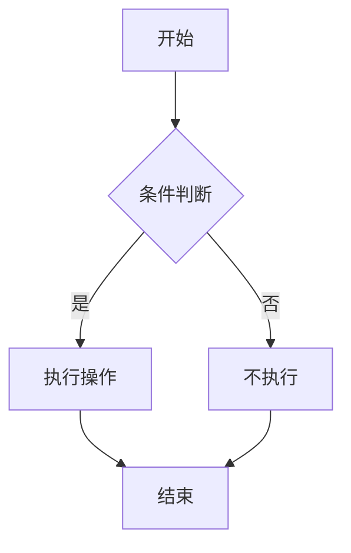

## 为什么学 Markdown？

Markdown 是程序员和写作者的**通用语言**。它是一种轻量级标记语言，用纯文本写出格式丰富的文档。

- **程序员必备**：GitHub README、Issue、PR、项目 Wiki 全用 Markdown
- **写作利器**：博客、笔记、技术文档的首选格式
- **效率极高**：手不离开键盘，专注于内容而非排版
- **跨平台通用**：任何文本编辑器都能打开，Git 可追踪变更

> 这篇文章本身就是用 Markdown 写的。你正在看的 `:::tip`、代码块、表格——全是 Markdown 语法。

---

## 基础语法

### 标题

```markdown
# 一级标题

## 二级标题

### 三级标题

#### 四级标题

##### 五级标题

###### 六级标题
```

标题独占一行，`#` 数量代表层级。一级和二级标题也可以用 `=` 和 `-` 的底线形式（不常用）。

:::tip[标题规范]

- 一篇文档通常只用一个一级标题
- 二级标题之间可以用 `---` 分隔（水平线）
- 不要跳级——三级下面就是四级，不要直接到五级
  :::

### 段落与换行

```markdown
这是一个段落。
空行产生新段落。

两个空格 + 回车  
产生换行（不产生新段落）。
```

**关键**：段落之间用**空行**分隔。段内换行需要在行末加**两个空格**再回车。

### 文本强调

```markdown
_斜体_ 或 _斜体_
**粗体** 或 **粗体**
**_粗斜体_** 或 **_粗斜体_**
~~删除线~~
`行内代码`
```

### 列表

```markdown
<!-- 无序列表 -->

- 项目一
- 项目二
  - 嵌套项（缩进 2 空格）
  - 另一个嵌套项

<!-- 有序列表 -->

1. 第一步
2. 第二步
   1. 子步骤（缩进 3 空格）
   2. 另一个子步骤

<!-- 任务列表（GitHub 扩展） -->

- [x] 已完成任务
- [ ] 待办任务
- [ ] 另一个待办
```

### 链接与图片

```markdown
<!-- 链接 -->

[链接文字](https://sakura-two-xi.vercel.app/)
[带提示的链接](https://example.com "鼠标悬停显示")

<!-- 引用式链接（适合多次引用同一 URL） -->

[Google][1]
[GitHub][2]

[1]: https://google.com
[2]: https://github.com

<!-- 图片 -->


<!-- 可点击的图片 -->

[](https://example.com)
```

### 引用

```markdown
> 这是一段引用文字。
> 可以跨多行。
>
> > 支持嵌套引用。
> > 多层嵌套。
```

### 水平线

```markdown
---
---

---
```

三个或更多的 `---`、`***`、`___`。

:::caution[注意]
`---` 放在标题下面会被某些解析器（如 YAML frontmatter）误解。建议使用 `***` 或 `___` 作为水平线。
:::

---

## 代码块

### 行内代码

用反引号包裹：`` `code` ``

如果代码中包含反引号，用双重反引号：``` `` ` `` ```

### 围栏代码块

````markdown
```语言名称
你的代码在这里
```
````

**示例**：

````markdown
```python
def fibonacci(n):
    """返回第 n 个斐波那契数"""
    if n <= 1:
        return n
    a, b = 0, 1
    for _ in range(n - 1):
        a, b = b, a + b
    return b
```

```bash
$ git log --oneline -5
$ npm install express
```

```sql
SELECT u.name, COUNT(o.id)
FROM users u
LEFT JOIN orders o ON u.id = o.user_id
GROUP BY u.id
HAVING COUNT(o.id) > 5;
```
````

### 常用语言标识

| 标识                    | 语言       |
| ----------------------- | ---------- |
| `python` / `py`         | Python     |
| `cpp` / `c++`           | C++        |
| `javascript` / `js`     | JavaScript |
| `typescript` / `ts`     | TypeScript |
| `go`                    | Go         |
| `rust`                  | Rust       |
| `java`                  | Java       |
| `sql`                   | SQL        |
| `bash` / `shell` / `sh` | Shell      |
| `yaml` / `yml`          | YAML       |
| `json`                  | JSON       |
| `html`                  | HTML       |
| `css`                   | CSS        |
| `markdown` / `md`       | Markdown   |
| `diff`                  | Diff 对比  |
| `dockerfile`            | Dockerfile |

### Diff 格式

```diff
- 删除的行
+ 新增的行
  不变的行
```

````markdown
```diff
 function greet(name) {
-    console.log("Hello " + name)
+    console.log(`Hello, ${name}!`)
 }
```
````

---

## 表格

```markdown
| 左对齐 | 居中对齐 | 右对齐 |
| :----- | :------: | -----: |
| 数据   |   数据   |   数据 |
| 长文本 |  长文本  | 长文本 |
```

列对齐由冒号位置决定：

- `:---` 左对齐
- `:---:` 居中
- `---:` 右对齐

### 复杂表格技巧

```markdown
| 特性     |  Markdown   |   Word    |    LaTeX    |
| :------- | :---------: | :-------: | :---------: |
| 学习曲线 |   ⭐ 极低   |  ⭐⭐ 低  | ⭐⭐⭐⭐ 高 |
| 排版控制 |    基础     |   丰富    |    极致     |
| 数学公式 |  插件支持   |   麻烦    |    原生     |
| 版本控制 | ✅ Git 友好 | ❌ 二进制 |  ✅ 纯文本  |
| 适用场景 | 博客、笔记  | 正式文档  |  学术论文   |
```

---

## 进阶扩展

现代 Markdown 引擎（如本文所用）支持很多有用的扩展：

### 数学公式（KaTeX / MathJax）

```markdown
行内公式：$E = mc^2$

块级公式：

$$
\sum_{i=1}^{n} i = \frac{n(n+1)}{2}
$$

矩阵：

$$
\begin{pmatrix}
a & b \\
c & d
\end{pmatrix}
$$

积分：

$$
\int_0^\infty e^{-x^2} dx = \frac{\sqrt{\pi}}{2}
$$
```

### 脚注

```markdown
这是一个需要注释的句子。[^1]

[^1]: 这是脚注内容。
```

### 定义列表

```markdown
术语
: 定义内容

Markdown
: 一种轻量级标记语言
: 由 John Gruber 在 2004 年创建
```

### 缩写

```markdown
HTML 规范由 W3C 维护。

_[HTML]: HyperText Markup Language
_[W3C]: World Wide Web Consortium
```

### Admonition（提示框）

在支持的环境中（如 GitHub、本文使用的 Astro），可以用指令创建漂亮的提示框：

```markdown
:::note
这是一条普通注释。
:::

:::tip[小技巧]
这是一条贴士。
:::

:::warning
这是一条警告。
:::

:::caution[注意]
需要小心的地方。
:::

:::important
重要信息。
:::
```

### Mermaid 图表

````markdown

````


### 表情符号

```markdown
GitHub 风格的 emoji：
:smile: :rocket: :bug: :fire: :memo: :white_check_mark:
:warning: :bulb: :tada: :heart: :zap: :sparkles:
```

常用 emoji 速查：

| 代码         | 表情 | 使用场景   |
| ------------ | ---- | ---------- |
| `:bug:`      | 🐛   | 修 bug     |
| `:sparkles:` | ✨   | 新功能     |
| `:memo:`     | 📝   | 文档更新   |
| `:fire:`     | 🔥   | 删除代码   |
| `:rocket:`   | 🚀   | 性能优化   |
| `:tada:`     | 🎉   | 里程碑     |
| `:warning:`  | ⚠️   | 破坏性变更 |

### HTML 内联

Markdown 中可以嵌入原始 HTML：

```markdown
<details>
<summary>点击展开详细内容</summary>

这里的内容默认是折叠的，点击标题才会展开。

- 可以放列表
- 代码块
- 任何 Markdown 内容

</details>

<br> <!-- 强制换行 -->

<kbd>Ctrl</kbd> + <kbd>C</kbd> <!-- 键盘按键样式 -->

<mark>高亮文本</mark> <!-- 高亮 -->
```

---

## 前端染处理（Frontmatter）

许多 Markdown 驱动的工具（如 Jekyll、Hugo、Astro、Obsidian）支持在文件头部添加 **YAML 元数据**：

```markdown
---
title: 我的文章标题
date: 2026-06-08
tags: [Markdown, 教程]
category: 技术
draft: false
author: 你的名字
---
```

用 `---` 开头和结尾，中间是 YAML 格式的键值对。这些元数据不会显示在正文中，而是被静态站点生成器用来分类、筛选和渲染页面。

---

## 写作工具推荐

### 编辑器

| 工具              | 平台   | 特点                         |
| ----------------- | ------ | ---------------------------- |
| **VS Code**       | 全平台 | 免费、插件丰富、实时预览     |
| **Typora**        | 全平台 | 所见即所得，数学公式支持好   |
| **Obsidian**      | 全平台 | 双向链接、知识图谱、插件生态 |
| **Notion**        | 全平台 | 协作、数据库、一键导出       |
| **JetBrains IDE** | 全平台 | 内置预览，适合代码和文档混写 |

### VS Code 推荐插件

| 插件                      | 用途                         |
| ------------------------- | ---------------------------- |
| Markdown All in One       | 快捷键、目录生成、自动格式化 |
| Markdown Preview Enhanced | 增强预览（流程图、数学公式） |
| markdownlint              | 语法检查与规范               |
| Paste Image               | 粘贴图片自动保存             |
| Mermaid Markdown Syntax   | Mermaid 语法高亮             |

### 在线工具

- [StackEdit](https://stackedit.io/) — 在线 Markdown 编辑器
- [Dillinger](https://dillinger.io/) — 简洁的在线编辑器
- [Markdown Table Generator](https://www.tablesgenerator.com/markdown_tables) — 表格生成器
- [Mermaid Live Editor](https://mermaid.live/) — 在线绘制 Mermaid 图表

---

## Markdown 风格指南

遵循一致的写作规范，让你的文档专业且易读：

```markdown
<!-- ✅ 推荐 -->

# 标题

正文内容。

## 二级标题

- 列表项前面有空行（可选，但更清晰）

<!-- ❌ 避免 -->

#标题（缺少空格）

# 一级标题

### 三级标题（跳过了二级）
```

### 最佳实践

1. **标题前后加空行**：标题上方和下方各保留一个空行（开头除外）
2. **控制行宽**：每行不超过 80-100 字符，方便 Git diff 和分屏阅读
3. **代码块必须指定语言**：` ```python ` 而非 ` ``` `
4. **链接用引用式**：如果同一个 URL 多次出现，用引用式减少重复
5. **列表嵌套保持一致的缩进**：推荐 2 或 4 空格
6. **为图片写替代文字**：`` 中的「架构图」就是 alt text
7. **不要滥用强调**：一篇文章 2-3 处粗体就够了，全是粗体等于没有强调

---

## 常见问题速查

| 问题                           | 解决方案                                        |
| ------------------------------ | ----------------------------------------------- |
| 如何在代码块中显示反引号？     | 外层用更多反引号包裹：`` ` ``` ` ``             |
| 如何在表格中显示 `\|`？        | 用 `\|` 转义                                    |
| 如何显示字面量的 `*` `_` `[`？ | 用 `\*` `\_` `\[` 转义                          |
| 列表嵌套代码块如何缩进？       | 代码块相对于列表项缩进 4 空格                   |
| Markdown 中如何修改图片大小？  | 用 HTML：``        |
| 如何跨文件引用？               | Obsidian 支持 `[[文件名]]`；GitHub 支持相对链接 |

---

## 实战：写一篇完整的技术博客

综合运用上面学到的语法，以下是技术文章的标准结构模板：

````markdown
---
title: 文章标题
date: 2026-06-08
tags: [标签1, 标签2]
---

## 背景

简述为什么要写这篇文章。[^ref]

[^ref]: 相关参考链接。

## 核心内容

### 概念解释

:::tip[关键点]
重要的小贴士。
:::

| 对比维度 | 方案 A | 方案 B |
| :------- | :----: | :----: |
| 性能     |   好   |  一般  |
| 复杂度   |   高   |   低   |

### 代码示例

```python
def main():
    print("Hello, Markdown!")
```
````

## 总结

- 要点 1
- 要点 2
- 要点 3

## 参考

- [链接文字](https://example.com)

```

---

## 推荐资源

- [Markdown Guide](https://www.markdownguide.org/) — 最权威的 Markdown 教程（英文）
- [GitHub Flavored Markdown Spec](https://github.github.com/gfm/) — GitHub 扩展规范
- [CommonMark](https://commonmark.org/) — Markdown 标准化规范
- [Markdown 书写风格指南](https://github.com/othree/markdown-syntax-zhtw) — 中文版

---

## 总结

1. Markdown 的核心理念是**用纯文本写富文档**——简单、可读、可版本控制
2. 基础语法：标题、段落、强调、列表、链接、图片、引用、代码、表格
3. 扩展功能（KaTeX 数学公式、Mermaid 图表、Admonition）让 Markdown 强大到可以写论文和书籍
4. 统一写作风格、指定代码语言、写好 alt text——这些细节区分了「能用」和「专业」
5. 选一个好编辑器，配置好插件，把注意力放在**内容**上——这才是 Markdown 的初衷
```
